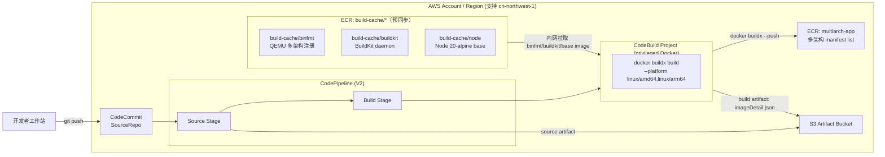

# 架构文档

## 目标

验证基于 AWS Code Suite（CodeCommit + CodePipeline + CodeBuild + ECR）的多架构容器镜像构建流水线：一次代码推送即可自动构建并推送 `linux/amd64` + `linux/arm64` 双架构镜像到 ECR，同时验证用 ECR build-cache 预同步公共基础镜像解决中国区 CodeBuild 无法稳定访问 Docker Hub 的问题。

参考方案：[Multi-architecture container image build pipeline based on Amazon Code Suite](https://aws.amazon.com/cn/blogs/china/multi-architecture-container-image-build-pipeline-based-on-amazon-code-suite/)。

## 组件

- **源码仓库**：`AWS::CodeCommit::Repository`，开发者 `git push` 的目标仓库，触发流水线
- **流水线**：`AWS::CodePipeline::Pipeline`（V2），Source → Build 两阶段
- **构建项目**：`AWS::CodeBuild::Project`，`privileged: true` 的 Docker 环境，执行 `infra/buildspec.yml`
- **镜像仓库**：`AWS::ECR::Repository`（`multiarch-app`），保存最终多架构 manifest list，`imageScanOnPush` 开启
- **构建缓存仓库**：账号内 ECR 的 `build-cache/binfmt`、`build-cache/buildkit`、`build-cache/node`，预同步的 QEMU/BuildKit/Node base 镜像，供 CodeBuild 走内网拉取
- **Artifact Bucket**：`AWS::S3::Bucket`（CodePipeline 产物存储，`RemovalPolicy.DESTROY`）
- **IAM**：CodeBuild 角色被授予 `imageRepo.grantPullPush`、`ecr:GetAuthorizationToken`，以及对三个 `build-cache/*` 仓库的只读层拉取权限
- **IaC**：AWS CDK（`infra/main.ts`），支持通过 context 参数自定义仓库名、流水线名、平台列表等

## 架构图

代码推送到 CodeCommit 后，CodePipeline 的 Source 阶段拉取代码放入 S3 artifact bucket，触发 Build 阶段的 CodeBuild 项目。CodeBuild 先登录账号内 ECR，从 `build-cache/binfmt` 拉取镜像注册 QEMU 多架构支持，从 `build-cache/buildkit` 拉取镜像创建 buildx builder。

构建阶段以 `build-cache/node:20-alpine` 为 `BASE_IMAGE`，执行 `docker buildx build --platform linux/amd64,linux/arm64 --push`，把两个架构的镜像以同一 tag 推送到 `multiarch-app` ECR 仓库，形成一份 multi-arch manifest；最后把 `imageDetail.json` 写入 build artifact。

## 关键技术点：中国区镜像缓存

中国区 CodeBuild 无法稳定访问 Docker Hub 等公共镜像站，构建依赖的三个镜像需要预先同步到账号内 ECR，首次部署前须从网络可达的机器手动执行一次预同步（脚本见 `docs/architecture.md` 历史版本 / README）：

| ECR Repository | 来源镜像 | 用途 |
|---|---|---|
| `build-cache/binfmt` | `tonistiigi/binfmt:latest` | QEMU 多架构注册 |
| `build-cache/buildkit` | `moby/buildkit:buildx-stable-1` | BuildKit daemon |
| `build-cache/node` | `node:20-alpine`（amd64 + arm64，用 `buildx imagetools create` 完整复制 manifest） | 应用 base image |

同步完成后，CodeBuild 全程从 ECR 内网拉取，单次构建约 50 秒（相比直连公共镜像站的 8 分钟以上）。`build-cache/*` 镜像不会自动更新，需要按需手动刷新（如 `node:20-alpine` 安全补丁、Node 大版本升级、`binfmt`/`buildkit` bug 修复）。

## 常用 CDK Context 参数

| 参数 | 默认值 | 说明 |
|---|---|---|
| `codeCommitRepoName` | `multiarch-container-app` | CodeCommit 仓库名称 |
| `pipelineName` | `multiarch-codepipeline` | CodePipeline 名称 |
| `projectName` | `multiarch-codebuild` | CodeBuild project 名称 |
| `branch` | `main` | CodePipeline 监听的 CodeCommit 分支 |
| `imageRepoName` | `multiarch-app` | ECR repository 名称 |
| `imageTag` | `latest` | 推送的镜像 tag |
| `platforms` | `linux/amd64,linux/arm64` | buildx 构建平台 |

ECR repository（`multiarch-app` 与 `build-cache/*`）默认由 CDK 保留，避免 `cdk destroy` 误删已构建镜像；CodePipeline artifact bucket 随 stack 删除，删除前需先清空。
